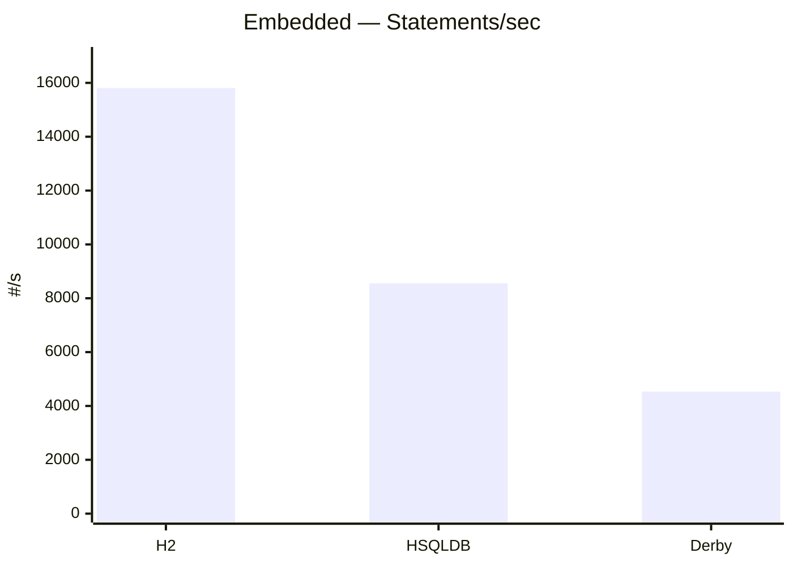
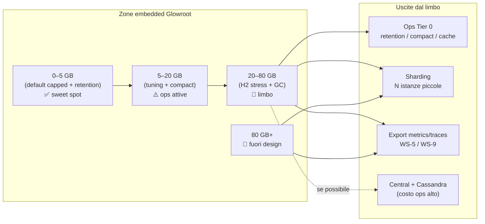

# Glowroot — Audit di revival e popolarità

| Campo | Valore |
|---|---|
| Data | 2026-09-01 (aggiornato; prima edizione 2026-08-31) |
| Autore | Nicholas Antinori (`Never-lab` / `JustKaneki`) |
| Repo analizzato | [glowroot/glowroot](https://github.com/glowroot/glowroot) |
| Fork di lavoro | [Never-lab/glowroot](https://github.com/Never-lab/glowroot) |
| Versione HEAD locale | `0.14.8-beta.5-SNAPSHOT` |
| Scopo | Stato reale del progetto + piano concreto per aumentare adozione e visibilità |

---

## TL;DR brutale

Glowroot **non è un progetto morto**. Il codice si muove, la CI passa, le release escono, Java 25 è supportato. Il problema è un altro: **il prodotto è tecnicamente vivo ma commercialmente e socialmente invisibile**.

- **~1.356 star** vs SkyWalking ~24.900 e Pinpoint ~13.860 — ordine di grandezza 10–18× indietro.
- **Il sito pubblico (`glowroot.org`) mostra ancora la 0.14.0** — sei anni di distanza dal messaggio GitHub.
- **La demo pubblica (`demo.glowroot.org`) risponde HTTP 522** — down almeno da gennaio 2025 ([#1102](https://github.com/glowroot/glowroot/issues/1102)).
- **Maven Central è abbandonato**: ultimo artifact `org.glowroot:glowroot-agent` = `0.14.0-beta.3` (2022). Chi cerca su Maven non trova nulla di recente.
- **Central collector quasi ignorato**: release `v0.14.7` → agent zip ~33.760 download cumulativi, central zip ~242 (**rapporto ~140:1**).
- **Backlog issue migliorato ma ancora pesante**: **77 issue aperte** (contatore repo: 90), **44 (>57%) hanno più di 3 anni** — calo netto vs 190/68% del 31/08 (probabilmente triage batch o conteggio diverso); solo **9 label** GitHub.
- **Governance fantasma**: `pom.xml` elenca solo Trask Stalnaker come developer; Trask non committa più su `main`; maintainer de facto = Sylvere Richard (`nowheresly`) + commit recenti da te (`Never-lab`).
- **11 PR aperte upstream, tutte tue** — bottleneck di review/merge peggiorato; include 4 PR strategiche aperte il 31/08 (#1222 Spring Boot, #1224 Helm, #1225 Docker demo, #1226 SECURITY.md).
- **Stack UI EOL**: AngularJS 1.7.9 (EOL 2022), Bower (deprecated), Grunt. Funziona, ma è un segnale visibile di “2018”.
- **Zero OpenTelemetry** nel codebase. Nel 2026 questo esclude Glowroot da molti shortlist architetturali.

**Verdetto:** il vantaggio competitivo reale (embedded, basso overhead, `-javaagent` in 5 minuti) **esiste ancora** ed è sottovalutato dal mercato perché onboarding, marketing, demo e ecosistema sono fermi o assenti. Non serve riscrivere Glowroot in OTel-native per crescere — serve **rendere provabile e trovabile** ciò che già funziona, poi colmare i gap ecosistema uno per uno.

### Delta dal 2026-08-31 (sync fork + refresh dati)

| Metrica | 2026-08-31 | 2026-09-01 | Nota |
|---|---:|---:|---|
| Issue aperte (API, no PR) | ~190 campionate | **77** | Calo enorme — verificare se triage massivo o metodologia diversa |
| Issue > 3 anni (%) | 68% | **57%** | Miglioramento relativo |
| PR aperte Never-lab | 7 | **11** | +4 PR strategiche (Spring Boot, Helm, demo Docker, SECURITY.md) |
| `upstream/main` locale | 3 commit indietro | **allineato** | Merge completato su fork |
| Ultimi commit `main` | mix `JustKaneki`/`Never-lab` | **`Never-lab` dominante** | Identità GitHub consolidata sui commit recenti |
| Download agent 0.14.7 | ~33.358 | **33.760** | +402 in 1 giorno (cumulativi) |
| Discussions | 59 | **60** | +1 |

**Fork sync (2026-09-01):** `main` fast-forward a `upstream/main` (`3f697a6fa`). Merge upstream su: `docs/revival-audit-2026-08-31`, `docs/readme-product-first`, `fix/1002-*`, `feature/1206-*`, `docs/1197-*`. **Non mergeati** (cronologie divergenti): `fix/1125-virtual-thread-profiling`, `ui/jvm-environment-polish` — richiedono rebase manuale.

---

## Metodologia

Dati raccolti il **2026-09-01** da:

| Fonte | Cosa |
|---|---|
| GitHub API (`gh api`) | stars, fork, issue, PR, release, contributor, discussions, CI |
| Repo locale | `/data/progetti/Glowroot` — struttura moduli, UI stack, test count, Dockerfile |
| HTTP probe | `glowroot.org`, `demo.glowroot.org` |
| Maven Search API | presenza artifact `org.glowroot` |
| Confronto | SkyWalking, Pinpoint, Scouter su GitHub stars |

**Nota issue count:** il contatore repo (`open_issues: 90`) include PR aperte; l'analisi età usa solo issue (`pull_request == null`) = **77**. Il report del 31/08 usava un campione diverso (190) — i numeri assoluti non sono direttamente comparabili senza verificare cosa è stato chiuso/triageato nel frattempo.

---

## 1. Numeri di riferimento

### 1.1 GitHub (2026-09-01)

| Metrica | Glowroot | SkyWalking | Pinpoint | Scouter |
|---|---:|---:|---:|---:|
| Stars | 1.356 | 24.937 | 13.860 | 2.181 |
| Fork | 337 | — | — | — |
| Open issues (counter repo) | 90 | — | — | — |
| Issue aperte (solo issue, no PR) | 77 | — | — | — |
| Watchers | 47 | — | — | — |
| Contributor (API) | 30 | — | — | — |
| Discussions totali | 60 | — | — | — |
| PR aperte (totale repo) | 14+ | — | — | — |
| License | Apache-2.0 | Apache-2.0 | Apache-2.0 | Apache-2.0 |
| Created | 2014-01-29 | — | — | — |
| Last push | 2026-08-30 | — | — | — |

### 1.2 Download release GitHub (cumulativi, non unici)

| Tag | Tipo | Data | Agent zip DL | Central zip DL |
|---|---|---|---:|---:|
| v0.14.8-beta.4 | pre-release | 2026-08-02 | 396 | 15 |
| v0.14.8-beta.3 | pre-release | 2026-06-08 | 375 | 30 |
| v0.14.7 | **stable** | 2026-05-11 | 33.760 | 242 |
| v0.14.6 | stable | 2026-03-24 | 22.293 | 3.375 |
| v0.14.5 | stable | 2026-03-08 | 1.793 | — |
| v0.14.4 | stable | 2025-05-25 | 131.752 | — |
| v0.14.2 | stable | 2024-04-07 | 251.303 | — |
| v0.14.0 | stable | 2023-05-14 | 268.537 | — |

**Lettura onesta:**

- I counter GitHub sono cumulativi e gonfiati da CI/mirror, ma il **trend relativo** conta: la 0.14.4 ha fatto numeri enormi (probabilmente link rotto altrove + upgrade wave), la 0.14.7 ne ha molti meno in 3 mesi.
- Le beta 0.14.8 hanno ~370 download agent ciascuna — utenti coraggiosi, non massa.
- **Central è un prodotto di nicchia dentro una nicchia.** Investire solo sull'agent embedded ha senso commerciale; ignorare Central però limita il posizionamento “multi-JVM enterprise”.

### 1.3 Codebase (locale)

| Metrica | Valore |
|---|---|
| File `.java` | 1.195 (esclusi target) |
| Linee Java (totale `wc -l`) | ~8.904 (esclusi target; cifra bassa perché molto codice è generato/shaded altrove nel build completo) |
| Plugin agent | 27 |
| File test `*Test.java` / `*IT.java` | 269 |
| File integration-tests | 71 |
| File benchmark JMH | 18 |
| Moduli Maven (top-level + agent) | 54 `pom.xml` |
| Agent dist zip (build locale) | ~41 MB |
| Versione in sviluppo | `0.14.8-beta.5-SNAPSHOT` |

### 1.4 Stack UI (da `ui/bower.json`, `ui/package.json`)

| Componente | Versione | Stato |
|---|---|---|
| AngularJS | 1.7.9 | **EOL** (LTS terminato 2022-01-01) |
| angular-ui-router | 1.0.20 | legacy |
| Bootstrap | fork `trask/bootstrap#glowroot-0.13.1` | fork privato |
| Bower | sì | **deprecated** dal 2017 |
| Grunt | build pipeline | legacy |
| Node deps | grunt, bower, … | nessun framework moderno |

---

## 2. Audit tecnico

### 2.1 Cosa funziona davvero

| Area | Evidenza | Giudizio |
|---|---|---|
| CI | Matrix Java 8/17/21/25 × testGroup 1–4 × shaded/unshaded × javaagent/local harness | **Robusto** — raro in OSS di questa età |
| Java moderno | Release note: Java 25, JEP 512 main, virtual threads (#1125 in PR), ASM 9.10.1 | **Competitivo** per agent Java |
| Architettura agent | 27 plugin, shading `org.glowroot.agent.shaded.*`, IT harness dedicato | **Solido**, estensibile |
| Embedded mode | H2 locale, UI in-process, zero infra | **Killer feature** — il vero differenziatore |
| Benchmark | Modulo `agent/benchmarks` con JMH | Presente ma **non pubblicizzato** |
| Docker Central | `central/Dockerfile`, JDK 25, OpenShift-friendly permissions | Esiste; **non è la storia di onboarding principale** |

### 2.2 Problemi tecnici che frenano adozione

| Problema | Evidenza | Impatto |
|---|---|---|
| **Nessun OTel** | grep `OpenTelemetry` nel repo = 0 match nel codice sorgente (6 match solo in questo report) | Escluso da architetture 2026 “OTel-first” |
| **Maven Central fermo** | `glowroot-agent` @ `0.14.0-beta.3`, timestamp 2022 | Chi usa Maven/Gradle dependency lookup non trova Glowroot |
| **Due agent sullo stesso JVM** | README: “Usually no” | Normale per bytecode agents, ma blocca migrazioni da altri APM |
| **Central richiede Cassandra** | wiki + Dockerfile + issue DNS/reconnect (#1151) | Barriera ops alta; spiega il rapporto 138:1 download |
| **Issue gravi recenti aperte** | #1162 ClassLoader leak Metaspace OOM; #1180 CPU/GC regression 0.14.4→0.14.7; #1165 flamegraph line numbers | Fiducia produzione scossa anche con release attive |
| **Checker Framework CI disabilitato** | `.github/workflows/build.yml` — job `checker` commentato | Qualità statica non enforced in CI |
| **No Dependabot** | `.github/dependabot.yml` assente | CVE nelle dipendenze: responsabilità manuale |
| **Perpetual beta** | 0.14.8-beta.4 latest tag; stable 0.14.7 di maggio | Team conservativi rimandano upgrade |
| **SLF4J 1.7 + Logback 1.2** nel parent POM | `slf4j.version` 1.7.36, `logback.version` 1.2.13 | SLF4J 2.x support aggiunto nelle note release ma stack parent legacy |

### 2.3 Commit recenti upstream (GitHub API, 2026-07/08/09)

Autori effettivi sul branch `main`:

| Autore GitHub | Nome | Commit recenti (esempi) |
|---|---|---|
| `Never-lab` | Nicholas Antinori | trace filters, woven LocalVariableTable, JUL NPE, health check, storage UI, breakdown timers |
| `nowheresly` | Sylvere Richard | readiness probe Cassandra, Infinispan update, release 0.14.8-beta.5 |
| `github-actions[bot]` | — | Release automation |

**Nota identità:** al 31/08 i commit diretti su `main` comparivano come `JustKaneki`; al 01/09 i commit recenti risultano tutti sotto `Never-lab`. Stesso operatore, identità GitHub consolidata.

`trask` (4.057 commit storici): **nessun commit recente su `main`**. Il bus factor nominale (Trask) ≠ bus factor reale (Sylvere + Nicholas).

---

## 3. Audit prodotto e UX

### 3.1 First impression — fallisce

| Touchpoint | Stato 2026-09-01 | Effetto |
|---|---|---|
| `glowroot.org` | HTTP 200; pagina mostra download **`glowroot-0.14.0-dist.zip`** | Visitatore conclude “abbandonato” |
| `demo.glowroot.org` | HTTP **522** (Cloudflare origin timeout) | Zero try-before-download |
| GitHub README | Migliorato su branch `docs/readme-product-first` + PR **#1190 aperta** (non mergeata) | Upstream README già decente ma demo link rotto |
| Wayback demo | Snapshot 2023-03-25 | Insufficiente per UI moderna e feature 0.14.x |
| Twitter `@glowroot` | linkato nel README | Canale legacy, attività non verificata |

**Conclusione:** un developer che scopre Glowroot oggi ha **tre segnali negativi consecutivi** (sito vecchio → demo morta → beta tag) prima ancora di leggere il codice.

### 3.2 Proposta di valore — ancora valida ma non difesa

Glowroot vince dove:

1. **Un team Java** (non polyglot) con **5–50 servizi**.
2. **Non vuole** Elasticsearch + HBase + OAP cluster + Grafana.
3. **Deve vedere** SQL lento, trace, flame graph **oggi**, non dopo un progetto osservabilità.

Glowroot perde dove:

1. Serve **distributed tracing cross-service** nativo (SkyWalking, Jaeger, Tempo).
2. Architettura **OpenTelemetry-native** obbligatoria.
3. **Kubernetes-first** con operator, Helm, sidecar pattern documentato.
4. **Metriche in Prometheus/Grafana** come standard di team.

### 3.3 Feature gap vs aspettative mercato 2026

| Feature | Stato Glowroot | Priorità per popolarità |
|---|---|---|
| OpenTelemetry export (OTLP) | Assente | Alta (ingresso nelle shortlist) |
| Prometheus metrics scrape | Quasi assente (issue #503 StatsD, #503 vecchia) | Alta |
| Spring Boot starter | Assente | **Altissima** (70%+ nuovi progetti Java) |
| Helm chart / K8s guide | Wiki parziale, no chart ufficiale | Media-alta |
| Docker one-liner demo agent | Assente (solo Central Dockerfile) | Alta |
| Grafana dashboard | Assente | Media |
| Log correlation | Limitata (logger plugin, no Loki/ELK story) | Media |
| Service map / topology | Richiesto (#1140, ago 2025) | Media |
| Dark mode UI | — | Bassa (percezione, non funzione) |

---

## 4. Audit distribuzione e discovery

### 4.1 Canali di distribuzione attuali

| Canale | Stato | Giudizio |
|---|---|---|
| GitHub Releases zip | **Primario**, funzionante | OK ma friction alta vs Maven/Docker |
| Maven Central | **Fermo al 2022** | Grave |
| Docker Hub org `glowroot` | 2 repo (API) | Esiste per Central; non è onboarding agent |
| Wiki GitHub | Estesa, utile | Buona per chi già adopera; non SEO |
| Google Group | Linkato, attività non verificata | Legacy |
| Blog / release notes | Solo GitHub Releases | Insufficiente per discovery esterna |
| Articoli comparativi 2026 | Glowroot citato come “lightweight Java” | Presenza **passiva**, non guidata |

### 4.2 SEO e citabilità

Glowroot compare in articoli “Best self-hosted APM 2026” come opzione **Java-only, lowest overhead**. Non compare nelle liste **OpenTelemetry / cloud-native**. Due ecosistemi diversi — il secondo cresce più veloce.

**Star history:** crescita lenta e piatta rispetto a SkyWalking. Senza demo + contenuti + integrazioni ecosistema, le star non decollano da sole.

---

## 5. Audit community e governance

### 5.1 Contributor

| Login | Commit (API) | Ruolo reale |
|---|---:|---|
| trask | 4.057 | Fondatore, **inattivo** su main |
| nowheresly (Sylvere Richard) | 366 | **Maintainer de facto**, merge/release |
| Never-lab (Nicholas) | 31 | Contributor attivo, PR ad alto volume |
| github-actions[bot] | 47 | Release automation |
| Altri 26 | 1–15 ciascuno | Sporadici |

**Bus factor effettivo: 2.** Se Sylvere smette, il progetto torna orphan nonostante 1.356 star.

### 5.2 Issue tracker — migliorato ma ancora critico

| Metrica | Valore (2026-09-01) | Valore (2026-08-31) |
|---|---:|---:|
| Issue aperte (solo issue) | **77** | ~190 campionate |
| Età > 3 anni | 44 (**57,1%**) | 130 (68,4%) |
| Età 1–3 anni | 29 (37,7%) | 54 (28,4%) |
| Età < 1 anno | 4 (5,2%) | 6 (3,2%) |
| Label disponibili | **9** | 9 |
| Contatore repo (`open_issues`) | 90 | 204 |

**Keyword nelle issue aperte (titolo, 2026-09-01):**

| Keyword | Count |
|---|---:|
| central | 4 |
| ui | 3 |
| cassandra | 3 |
| spring boot | 2 |
| prometheus | 1 |
| virtual thread | 1 |
| security | 1 |
| helm | 1 |

**Issue recenti (< 1 anno) — segnale qualità:**

| # | Data | Titolo |
|---|---|---|
| 1183 | 2026-06-29 | 0.14.6 not starting with Apache Procrun Windows Service |
| 1180 | 2026-06-17 | CPU load and GC pressure after 0.14.4 → 0.14.7 |
| 1165 | 2026-02-27 | Flamegraph same function at two line numbers |
| 1162 | 2026-02-20 | ClassLoader leak Metaspace OOM |
| 1151 | 2025-09-18 | Cannot reconnect to Cassandra when DNS changes |

### 5.3 Discussions

| Categoria | Count |
|---|---:|
| General | 27 |
| Q&A | 27 |
| Ideas | 5 |
| **Totale** | **60** |

59 discussioni totali in un progetto di 12 anni = **canale sottoutilizzato**. Il README recente (branch non mergeato) reindirizza Q&A → Discussions — direzione giusta, ma serve risposta attiva.

### 5.4 Governance formale — assente

| Documento | Presente |
|---|---|
| CODEOWNERS | No |
| GOVERNANCE.md | No |
| ROADMAP.md | No |
| MAINTAINERS.md | No |
| SECURITY.md | Non verificato in audit |
| Dependabot | No |

`pom.xml` `<developers>`: solo Trask Stalnaker, email 2011-era. **Non riflette la realtà 2026.**

### 5.5 PR backlog — collo di bottiglia umano

**PR mergeate da `Never-lab` (upstream):** 3 (#1185, #1189, #1203) — luglio 2026.

**PR aperte da `Never-lab` (upstream, 2026-09-01):** 11

| # | Titolo | Data |
|---|---|---|
| 1226 | SECURITY.md reporting policy | 2026-08-31 |
| 1225 | Local Docker demo (facsimile traffic) | 2026-08-31 |
| 1224 | Official glowroot-central Helm chart | 2026-08-31 |
| 1222 | Spring Boot starter marker + attach docs | 2026-08-31 |
| 1220 | Embedded scale stress harness + H2 index/SQL hardening | 2026-08-03 |
| 1217 | Central delete-agent-meta CLI + Admin Storage UI | 2026-08-02 |
| 1214 | Central JVM otherwise cascade | 2026-08-01 |
| 1191 | Fix thread profiling on JDK virtual threads (#1125) | 2026-07-20 |
| 1190 | Modernize README product-first | 2026-07-20 |
| 1188 | Embedded Deployment profile presets | 2026-07-18 |
| 1186 | UI enrich: transaction charts, JVM pages | 2026-07-18 |

**Lettura:** il backlog è **peggiorato in volume** (7→11) ma le 4 PR del 31/08 colpiscono direttamente WS-1/2/4/7 dell'audit — se mergeate, sbloccano demo, starter, Helm e SECURITY.md. Il rischio resta: troppe PR grandi contemporaneamente → review paralysis.

---

## 6. Confronto competitivo onesto

### 6.1 Matrice posizionamento

| Criterio | Glowroot | SkyWalking | Pinpoint |
|---|---|---|---|
| Setup minimo | **1 zip + javaagent** | Cluster OAP + storage | Collector + HBase |
| Overhead claim | **microsecondi** (benchmark interni) | ~3% | ~3% |
| Java depth | **Alta** (weaving, 27 plugin) | Alta | **Molto alta** |
| Polyglot | No | Sì | Java/PHP focus |
| OTel | No | Sì (nativo) | No |
| Stars | 1.3k | 25k | 14k |
| Foundation / governance | Contributor-driven | **Apache** | Naver OSS |
| UI | Built-in, dated | Built-in, modern-ish | Built-in, dated |
| Self-hosted costo ops | **Basso** (embedded) | Medio-alto | Alto |

### 6.2 Nicchia difendibile

Glowroot **non deve** competere head-to-head con SkyWalking. Deve **dominare**:

> “APM Java self-hosted per team piccoli/medi che vogliono risultati in 5 minuti senza un team platform.”

Questa nicchia esiste. Articoli 2026 la citano esplicitamente. Nessuno la sta **presidiando** con demo, starter, e case study.

### 6.3 Nicchia persa (se non agisce)

- Team che partono greenfield con **OTel + Grafana** nel 2026 non considereranno mai Glowroot.
- Team che restano Java monolith / Tomcat / Spring Boot tradizionale **sì** — se lo trovano.

---

## 7. Cosa NON è il problema

Per evitare lavoro inutile:

| Falso problema | Realtà |
|---|---|
| “Serve rewrite in Rust/Go” | No. Il valore è nel weaving Java e nei plugin. |
| “Serve UI React domani” | No. Serve demo funzionante domani. UI moderna = fase 3. |
| “Serve battere SkyWalking in star” | No. Target realistico: 2.500 star in 12 mesi (+84%). |
| “Il codice è abbandonato” | Falso. CI verde, release 2026, Java 25. |
| “Central va prioritizzato” | Solo se target enterprise multi-JVM. I numeri dicono embedded first. |

---

## 8. Piano d'azione — workstream atomici

Ogni workstream ha: **obiettivo**, **output misurabile**, **owner suggerito**, **effort**, **dipendenze**.

---

### WS-1: Demo pubblica

| Campo | Valore |
|---|---|
| Obiettivo | Try-before-download in < 60 secondi |
| Output | URL live con app Spring Boot instrumentata + dati sintetici (`UiSandboxMain`-like) |
| Opzioni | (A) Ripristinare `demo.glowroot.org` (B) Fly.io/Render (C) Docker `docker run glowroot/demo` |
| Owner | Sylvere (infra DNS) + Nicholas (app demo) |
| Effort | 2–5 giorni |
| Metrica | Uptime 99%; issue #1102 chiusa |
| Bloccante per | ogni altra iniziativa marketing |

**Minimo accettabile se infra non disponibile:** video/GIF 90s nel README + Compose file che avvia sandbox locale con un comando.

---

### WS-2: Allineamento sito e documentazione pubblica

| Campo | Valore |
|---|---|
| Obiettivo | `glowroot.org` coerente con GitHub Releases |
| Output | Download link → latest stable; sezione “0.14.x highlights”; link demo |
| Owner | Sylvere (DNS/S3) o chi ha accesso AWS |
| Effort | 1 giorno |
| Metrica | Sito referenzia ≥ 0.14.7 |

**Nel fork (subito):** merge PR #1190 README + wiki sync.

---

### WS-3: Release stable 0.14.8

| Campo | Valore |
|---|---|
| Obiettivo | Uscire dal loop beta percepito |
| Output | Tag `v0.14.8` stable, changelog, announcement Discussion |
| Criteri uscita | CI verde; nessun blocker P0 aperto; smoke test embedded + central |
| Owner | Sylvere (release manager) |
| Effort | 3–7 giorni (test + triage) |
| Metrica | `releases/latest` = stable, non beta |

---

### WS-4: Spring Boot starter

| Campo | Valore |
|---|---|
| Obiettivo | `-javaagent` discoverable da ecosistema Spring |
| Output | `org.glowroot:glowroot-spring-boot-starter` o doc + Gradle/Maven snippet ufficiale |
| Owner | Nicholas (già conosce codebase) |
| Effort | 3–10 giorni |
| Metrica | Mention in Spring ecosystem; download Maven misurabile |
| Dipendenze | WS-3 (versione stable) per non pubblicare beta |

---

### WS-5: Export metriche (Prometheus / StatsD)

| Campo | Valore |
|---|---|
| Obiettivo | Integrazione con stack osservabilità esistente senza sostituire Glowroot UI |
| Output | Endpoint `/metrics` Prometheus o exporter StatsD (issue #503 esiste) |
| Owner | Contributor + review Sylvere |
| Effort | 1–2 settimane |
| Metrica | Dashboard Grafana template in repo |

---

### WS-6: Issue triage e hygiene

| Campo | Valore |
|---|---|
| Obiettivo | Backlog leggibile |
| Output | Chiudere stale >3y senza riproduzione; label `P0/P1/good-first-issue`; template issue |
| Owner | Nicholas (già `docs/1197-issue-knowledge-map`) + Sylvere |
| Effort | 2–3 giorni iniziali, poi 1h/settimana |
| Metrica | Open issues < 100; < 40% older than 3y |

---

### WS-7: Governance minima

| Campo | Valore |
|---|---|
| Obiettivo | Chiarire chi decide e chi risponde |
| Output | `MAINTAINERS.md` (Sylvere + Nicholas); aggiornare `pom.xml` developers; `CODEOWNERS` |
| Owner | Sylvere (accettazione) + Nicholas (PR) |
| Effort | 2 ore |
| Metrica | PR review SLA dichiarato (es. 7 giorni) |

---

### WS-8: Contenuti e discovery

| Campo | Valore |
|---|---|
| Obiettivo | Essere citati attivamente, non solo passivamente |
| Output | (1) Benchmark JMH pubblicati (2) Case study produzione Afea (3) Post r/java, Dev.to (4) PR su awesome-java |
| Owner | Nicholas |
| Effort | 1 settimana spread nel tempo |
| Metrica | 3+ backlink da articoli/blog; +200 star in 6 mesi |

**Hook contenuto pronti oggi:** “Java 25 support”, “virtual threads profiling”, “embedded APM senza Cassandra”.

---

### WS-9: OpenTelemetry bridge (medio termine)

| Campo | Valore |
|---|---|
| Obiettivo | Non restare fuori dalle architetture OTel |
| Output | Export trace OTLP (read-only); doc “Glowroot UI + OTel backend” |
| Owner | Team (feature grande) |
| Effort | 4–8 settimane |
| Metrica | Issue “OTel” chiuse; mention in OTel registry/docs |
| Nota | **Non** è prerequisito per WS-1/2/3. È prerequisito per crescita oltre la nicchia Java tradizionale. |

---

### WS-10: Sblocco PR backlog (Nicholas)

| Campo | Valore |
|---|---|
| Obiettivo | Codice mergeato > codice proposto |
| Azione | Prioritizzare 4 PR “quick wins”: #1190 (README), #1225 (demo Docker), #1222 (Spring Boot), #1226 (SECURITY.md) |
| Split | PR grandi (#1186 UI, #1220 stress) → spezzare in PR reviewabili < 400 righe |
| Owner | Nicholas (split) + Sylvere (review) |
| Metrica | PR aperte < 5 (realistico dato volume attuale) |

---

## 9. Priorità — ordine di esecuzione

```
Fase 0 (settimana 1)     WS-10  Sbloccare PR backlog
                         WS-2   README merge + sito (se accesso)
                         WS-1   Demo minima (Compose o live)

Fase 1 (settimana 2–4)   WS-3   Stable 0.14.8
                         WS-6   Issue triage
                         WS-7   MAINTAINERS.md

Fase 2 (mese 2–3)        WS-4   Spring Boot starter
                         WS-5   Prometheus export
                         WS-8   Contenuti + benchmark pubblici

Fase 3 (mese 4–12)       WS-9   OTel bridge
                         UI modernization (workstream non dettagliato — solo dopo demo+starter)

Brainstorming (non in roadmap)   WS-11  Cursor Agent Skill — vedi §12
```

---

## 10. Metriche di successo (12 mesi)

| Metrica | Baseline 2026-09-01 | Target 2027-09-01 | Come misurare |
|---|---:|---:|---|
| GitHub stars | 1.356 | 2.500+ | GitHub |
| Download stable release (primi 90gg) | ~33.8k cumul. (0.14.7 totale) | > 5k primi 90gg nuova stable | GitHub API assets |
| Demo uptime | 0% | 99% | Uptime probe |
| Open issues | ~77 | < 100 | GitHub |
| Issue > 3 anni (%) | 57% | < 30% | Script |
| PR aperte Never-lab | 11 | ≤ 5 | GitHub |
| Contributor attivi/anno | 2–3 | ≥ 8 | GitHub |
| Maven Central latest | 0.14.0-beta.3 | ≥ stable corrente | search.maven.org |
| Menzioni blog comparativi | passiva | 3+ articoli con case study | manuale |

---

## 11. Ruolo Nicholas / Never-lab — situazione attuale

### Cosa hai già fatto (upstream, verificato)

- 3 PR mergeate (bugfix ad alta qualità): exported traces, Jackson nesting, WeakRef queue.
- **11 PR aperte** con feature docs/UI/infra — valore alto, merge zero da 32–45 giorni (le più vecchie).
- Commit diretti su `main` come `Never-lab` (trace filters, health check, storage UI, breakdown timers).
- Branch fork `docs/readme-product-first` con README product-first, star history, diagrammi architettura — **allineato a upstream/main** (2026-09-01).

### Cosa NON conviene fare (onesto)

- Aprire altre PR grandi finché WS-10 non sblocca il backlog.
- Investire mesi in UI rewrite prima di demo + stable release.
- Presentarsi come “maintainer” senza accordo esplicito con Sylvere — rischio friction community.

### Cosa conviene fare

1. **Accordo esplicito** con Sylvere su ruolo (co-maintainer? docs/release helper?).
2. **Spezzare** #1186 e #1220.
3. **Portare** case study Afea (JVM/SQL analysis che già fai) → articolo + Discussion.
4. **Ownare** WS-4 (Spring Boot starter) e WS-8 (contenuti) — allineati al tuo profilo ops/Java.

---

## 12. Brainstorming — Cursor Agent Skill (WS-11)

> **Stato:** idea in discussione · **2026-08-31**  
> **Azione:** nessuna per ora. Non implementare senza accordo con Sylvere e senza WS-6 (triage) avviato.

### Problema che mira a risolvere

Il tracker ha ~190 issue aperte; ~68% hanno più di 3 anni. Molte non sono bug — sono supporto/config mascherato da issue. Ogni risposta “leggi la wiki” costa tempo al maintainer e lascia issue zombie.

Flusso attuale (inefficiente):

```
Domanda vaga → GitHub Issue → maintainer → wiki link → issue resta aperta
```

### Proposta

Skill Cursor **`glowroot`** nel repo (`.cursor/skills/glowroot/`) come **front door** per chi usa Glowroot con un agent:

```
Domanda → agent + skill → diagnosi / link wiki / pattern noto
         ↓ (solo bug riproducibile + checklist compilata)
       GitHub Issue
         ↓ (solo idea nuova)
       Discussion → Ideas
```

La wiki resta source of truth canonica. La skill è il **runtime** che applica wiki + know-how al caso concreto.

### Relazione con asset già esistenti (Nicholas)

| Asset | Ruolo | Overlap skill |
|---|---|---|
| Wiki GitHub | Doc ufficiale, lenta da aggiornare | Skill linka wiki; non la sostituisce |
| `Analisi/TRIAGE-KNOWLEDGE.md` | Pattern da triage batch (~240 righe FAQ) | **Input principale** skill (sync in repo) |
| `docs/issue-map/` (branch `#1197`) | Dashboard + `triaged-ids.json` | Indice umano; skill legge pattern |
| Skill `analisi-engine` | Analisi export trace/dump **post-mortem** | Complementare: skill = pre-mortem ops/config |
| Discussion #1195 | Accordo triage con Sylvere | Skill automatizza gate Easy/Medium |

### Workflow skill (bozza)

**1. Classificazione richiesta**

| Tipo | Esempi | Destinazione |
|---|---|---|
| How-to / config | UI non si apre, H2 locked, agent.id K8s | Wiki + risposta; **no issue** |
| Expected behavior | Breakdown ≠ entries; Service Calls vuoto su @Service | Limite plugin; **no issue** |
| Diagnosi | CPU post-upgrade; trace senza SQL | Checklist; issue solo se riproducibile |
| Bug | NPE, regression con steps | Issue con template |
| Idea | OTel export, Prometheus | Discussion Ideas |
| Trace analysis | export HTML/JSON | Delega a `analisi-engine` |

**2. Gate anti-issue dummy (obbligatorio prima di suggerire Issue)**

```
□ Versione Glowroot (tag release, non “latest”)
□ Mode: embedded | central
□ JDK + application server
□ -javaagent prima di -jar (se executable JAR)
□ Log line “UI listening on …” presente o assente
□ Pattern cercato in TRIAGE-KNOWLEDGE / issue-map
```

Se checklist incompleta → Discussion Q&A, non Issue.

**3. Output standard agent**

- Diagnosis (1–3 frasi)
- Likely cause (pattern `#NNN` o wiki)
- Actions ordinate
- Verdict: **no issue** | **issue** (con repro) | **discussion**

### Flywheel wiki ↔ skill

1. Domanda nuova → skill non trova pattern → risposta + proposta patch wiki (1 paragrafo).
2. Triage batch → aggiorna `TRIAGE-KNOWLEDGE.md` + wiki se serve.
3. Stessa domanda → skill risponde senza GitHub.

Issue **chiuse** = know-how only (protocollo già in TRIAGE-KNOWLEDGE: zero commenti, zero reopen).

### Struttura file (non creata — solo design)

```
glowroot/.cursor/skills/glowroot/
├── SKILL.md              # workflow + trigger + gate
├── triage-patterns.md    # sync da TRIAGE-KNOWLEDGE / issue-map
├── decision-tree.md      # embedded vs central, tab vuoti, …
└── issue-gate.md         # template pre-issue (esportabile anche come GitHub issue template)
```

### Dove hostarla

| Opzione | Pro | Contro |
|---|---|---|
| Project skill nel repo | Scalabile, reviewabile, differenziatore vs altri APM | Serve merge upstream |
| Personal `~/.cursor/skills/` | Immediato, zero permessi | Solo Nicholas |
| Entrambe | Draft personale → PR upstream | Sync da mantenere |

**Preferenza indicata:** draft nel fork, menzione in README quando matura; allineamento Sylvere prima del merge upstream.

### Impatto atteso (stima, non misurato)

| Oggi | Con skill + gate |
|---|---|
| ~40% issue ≈ supporto mascherato | → Discussion o chiusura |
| Duplicate “empty Queries / Service Calls” | → pattern `#746`, `#812`, wiki Plugin coverage gaps |
| Issue senza versione/mode | → bloccate da checklist |

Non “zero issue dummy” garantito — riduzione forte del rumore su WS-6.

### Limiti onesti

- Non sostituisce maintainer per merge, release, permessi GitHub.
- Senza demo live, l’agent non prova Glowroot — resta knowledge-driven.
- Skill invecchia se `TRIAGE-KNOWLEDGE` non si aggiorna (stesso rischio della wiki).
- Utenti senza Cursor: esportare `issue-gate.md` come GitHub Issue template + bot checklist.

### Collegamento workstream audit

| WS | Rapporto con WS-11 |
|---|---|
| WS-6 Issue triage | Skill automatizza Easy/Medium; umano resta su Hard |
| WS-8 Contenuti | Ogni gap skill → paragrafo wiki |
| WS-10 PR backlog | Meno issue dummy → più bandwidth review |
| WS-1 Demo | Skill compensa parzialmente assenza demo con checklist |

### Criteri per passare da brainstorming a implementazione

1. Accordo esplicito Sylvere (discussion #1195 o thread dedicato).
2. `docs/issue-map/` + `TRIAGE-KNOWLEDGE.md` canonicali nel repo (non solo copia Analisi).
3. WS-6 avviato (almeno 1 batch triage con pattern documentati).
4. Issue template GitHub allineato al gate (beneficio anche senza Cursor).

**Effort stimato (quando/se approvato):** 1–2 giorni draft skill + sync triage-patterns; ongoing = aggiornamento a ogni batch triage.

---

## Appendice A — Verifica endpoint (2026-09-01)

| URL | HTTP | Nota |
|---|---|---|
| https://glowroot.org/ | 200 | Contenuto obsoleto (0.14.0) |
| https://demo.glowroot.org/ | **522** | Origin timeout Cloudflare |
| https://github.com/glowroot/glowroot | 200 | Attivo |
| Maven `org.glowroot:glowroot-agent` | — | Latest: 0.14.0-beta.3 (2022) |

---

## Appendice B — CI (`.github/workflows/reusable-build.yml`)

Matrix completa:

- Java: 8, 17, 21, 25
- testGroup: 1, 2, 3, 4
- testShaded: true, false
- glowrootHarness: javaagent, local

Job disabilitati in `build.yml`: Checker Framework, SauceLabs cross-browser.

Ultimi run CI (2026-09-01): `main` → success (schedule + issue_comment).

---

## Appendice C — Plugin agent (27)

`camel`, `cassandra`, `ejb`, `elasticsearch`, `executor`, `grails`, `hibernate`, `http-client`, `jakarta-servlet`, `java-http-server`, `jaxrs`, `jaxws`, `jdbc`, `jms`, `jsf`, `jsp`, `kafka`, `logger`, `mail`, `mongodb`, `netty`, `play`, `quartz`, `redis`, `servlet`, `spring`, `struts`

---

## Appendice D — Release stable timeline

| Versione | Data stable |
|---|---|
| 0.14.7 | 2026-05-11 |
| 0.14.6 | 2026-03-24 |
| 0.14.5 | 2026-03-08 |
| 0.14.4 | 2025-05-25 |
| 0.14.2 | 2024-04-07 |

**Gap 0.14.2 → 0.14.4:** 13 mesi senza stable. Pattern che alimenta percezione “beta eterna”.

---

## Appendice E — File e branch fork rilevanti

| Branch fork | Contenuto | Sync upstream (2026-09-01) |
|---|---|---|
| `docs/readme-product-first` | README modernizzato, star history, diagrammi architettura | ✅ allineato |
| `docs/revival-audit-2026-08-31` | Questo report + merge upstream | ✅ allineato |
| `docs/1197-issue-knowledge-map` | Mappa knowledge issue | ✅ allineato |
| `feature/1206-adhoc-report-breakdown-timers` | Feature report breakdown timers | ✅ allineato |
| `fix/1002-embedded-ui-init-logging` | Logging init UI embedded | ✅ allineato |
| `fix/1125-virtual-thread-profiling` | Virtual threads (anche PR #1191 upstream) | ⚠️ cronologia divergente — rebase manuale |
| `ui/jvm-environment-polish` | UI polish transaction/JVM | ⚠️ cronologia divergente — rebase manuale |

---

## §13 UI stack — strategia e matrice dipendenze (2026-09-01)

> **Contesto:** discussione post-audit su AngularJS / Bower / Grunt.  
> **Verdetto:** rewrite framework = Fase 3; tooling npm+Vite = Fase 2; patch 1.7→1.8 = opzionale.

### 13.1 Dimensione codebase UI

| Metrica | Valore |
|---|---|
| File JS (`app/scripts`) | 87 |
| Righe JS | ~16.400 |
| Template HTML | 96 |
| File SCSS | 18 |
| Webdriver IT (UI-related) | ~11 classi, selettori DOM fragili |
| Build | Bower → Grunt (concat, uglify, filerev, sass) → JAR |

### 13.2 Tre livelli di intervento (recap)

| Livello | Cosa | Effort | Quando |
|---|---|---|---|
| **L1** | AngularJS 1.7.9 → 1.8.3 + bump lib non-fork | 3–5 gg | Solo CVE / difesa |
| **L2** | Bower→npm, Grunt→Vite; framework resta AngularJS | 2–4 sett | Dopo stable 0.14.8 + demo |
| **L3** | Rewrite React/Vue/Angular moderno | 3–9 mesi | Roadmap esplicita maintainer |

### 13.3 Matrice dipendenze (`ui/bower.json`)

Legenda **Rischio bump:** 🟢 basso · 🟡 medio · 🔴 alto · ⛔ bloccato (fork/replatform)

Legenda **Azione:** `keep` · `patch` · `vendor` · `replace` · `replatform`

| # | Dipendenza | Versione | Provenienza | Uso Glowroot | Rischio | Azione L1 | Azione L2/L3 | Alternativa moderna | Note |
|---|---|---|---|---|---|---|---|---|---|
| 1 | **angular** | 1.7.9 | npm/bower upstream | Core SPA, 53 file JS | 🟡 | `patch` → 1.8.3 | `keep` fino a L3 | React / Vue / Angular 19+ | EOL gen 2022; 1.8.3 = ultima release |
| 2 | **angular-sanitize** | 1.7.9 | upstream | `$sanitize` in template HTML | 🟡 | `patch` con angular | `keep` | DOMPurify (L3) | Bump lockstep con angular |
| 3 | **angular-ui-router** | 1.0.20 | upstream | Routing (`routes.js`), tutte le pagine | 🟡 | `patch` → 1.0.30 | `keep` | React Router / Vue Router | API stabile; test webdriver routing |
| 4 | **angular-ui-bootstrap4** | Morgul 3.0.5 | **fork** (Bootstrap 4) | Popover, typeahead, tooltip, template build | 🔴 | `keep` | `vendor` in repo | ng-bootstrap (Angular 2+) o Radix/shadcn (L3) | Fork per BS4; non aggiornabile trivialmente |
| 5 | **angular-ui-codemirror** | 0.3.0 | upstream (stale) | Modulo `ui.codemirror` — config JSON/plugin | 🟡 | `keep` | `replace` wrapper | CodeMirror 6 + thin wrapper | Wrapper AngularJS 1.x abbandonato |
| 6 | **bootstrap** | trask `#glowroot-0.13.1` | **fork Trask** | Layout grid, navbar, form admin | ⛔ | `keep` | `vendor` + documentare patch | Bootstrap 5 (breaking) | Patch CSS/JS custom; BS5 = rewrite markup |
| 7 | **bootstrap-select** | trask `#glowroot-0.13.1` | **fork Trask** | Directive `gtSelectpicker`, agent dropdown Central | ⛔ | `keep` | `vendor` | Tom Select / Choices.js (L3) | Usato in `directives.js`, transaction/jvm navbar |
| 8 | **bootstrap-multiselect** | trask `#glowroot-0.11.0` | **fork Trask** | Directive multiselect, report adhoc agenti | ⛔ | `keep` | `vendor` | Tom Select multi (L3) | `adhoc.js`, `directives.js` |
| 9 | **jquery** | 3.3.1 | upstream | Flot, selectpicker, datetimepicker, DOM trace | 🟡 | `patch` → 3.7.1 | `patch` | Eliminare con L3 | CVE note su 3.3.x; accoppiato a Flot |
| 10 | **popper.js** | 1.16.0 | upstream | Bootstrap 4 tooltip/dropdown | 🟡 | `patch` → 1.16.1 | `patch` | @popperjs/core v2 (con BS5) | Legato a bootstrap fork |
| 11 | **flot** | trask `#glowroot-0.11.0` | **fork Trask** | **Tutti i chart** time-series (`charts.js`, transaction, JVM, report) | ⛔ | `keep` | `vendor` | Chart.js / uPlot / ECharts (L3) | Cuore UI; patch breakdown/stacked; ~6 file |
| 12 | **flot.tooltip** | trask `#glowroot-0.9.27` | **fork Trask** | Tooltip chart hover | ⛔ | `keep` | `vendor` | Incluso in lib chart L3 | Accoppiato a flot fork |
| 13 | **d3** | 5.7.0 | upstream | Flame graph (async load) | 🟡 | `patch` → 5.16 | `patch` | d3 v7 (L3) | Solo pagine flame graph |
| 14 | **d3-flame-graph** | trask `#glowroot-0.11.1` | **fork Trask** | `flame-graph.js`, `trace-flame-graph.js` | ⛔ | `keep` | `vendor` | d3-flame-graph upstream + re-patch | Fork per integrazione Glowroot / performance SVG |
| 15 | **codemirror** | 5.42.2 | upstream | Editor config avanzata, plugin instrumentation | 🟡 | `patch` → 5.65.x | `patch` | CodeMirror 6 | Mode clike + matchbrackets |
| 16 | **handlebars** | 4.3.5 | upstream | Trace detail rendering (`handlebars-rendering.js`, export) | 🟢 | `patch` → 4.7.8 | `patch` | Template lit/html (L3) | Grunt precompile → `handlebars-templates.js` |
| 17 | **moment** | 2.29.4 | upstream | Date/time ovunque (14 file), `#1108` 24h clock | 🟢 | `keep` (già recente) | `replace` → luxon/dayjs | luxon + Intl | moment in maintenance mode |
| 18 | **moment-timezone** | 0.5.41 | upstream | Timezone chart range | 🟢 | `patch` → 0.5.45 | con luxon (L3) | Intl + luxon zones | |
| 19 | **tempusdominus** | 5.1.2 | upstream | Date picker custom range (`directives.js`) | 🟡 | `patch` minor | `keep` | flatpickr (L3) | BS4 + moment dependent |
| 20 | **sequeljs** | trask `#glowroot-0.13.4` | **fork Trask** | SQL pretty-print trace (`parser.js`, SqlPrettyPrinter) | ⛔ | `keep` | `vendor` | sql-formatter (npm) | Patch LIMIT keyword (#10f5e93ad) |
| 21 | **clipboard.js** | trask `#glowroot-0.10.11` | **fork Trask** | Copy trace/export (`clipboard.js`) | 🟡 | `vendor` o `patch` | `replace` → clipboard@2 npm | Navigator.clipboard API | Fork minore; wrapper `gtClipboard` |
| 22 | **spinjs** | 2.3.2 | upstream | Loading spinner (`Glowroot.showSpinner`) | 🟢 | `keep` | `replace` CSS spinner | CSS `@keyframes` | Tiny dep |
| 23 | **fontawesome** | 5.6.3 | upstream (vendored woff) | Icone UI | 🟡 | `patch` → 5.15.4 | `patch` | Font Awesome 6 / Lucide (L3) | Font self-hosted in `index.html` |
| 24 | **focus-visible** | 4.1.5 | upstream | A11y focus ring | 🟢 | `patch` → 5.x | `patch` | `:focus-visible` nativo (drop?) | Browser support ampio 2026 |

### 13.4 Tooling build (non in bower.json)

| Componente | Versione | Rischio | Azione L2 | Alternativa |
|---|---|---|---|---|
| **bower** | 1.8.14 | ⛔ deprecated | **Eliminare** → npm | npm/pnpm workspaces |
| **grunt** + 15 plugin | 1.6.1 | 🔴 | **Sostituire** → Vite | esbuild + vite-plugin-static-copy |
| **grunt-usemin** | 3.1.1 | 🔴 | Rev hash in Vite build | `vite-plugin-revision` |
| **grunt-angular-templates** | 1.2.0 | 🟡 | `vite-plugin-html` o script prebuild | ngtemplate-loader equivalent |
| **grunt-contrib-handlebars** | 3.0.0 | 🟡 | handlebars CLI prebuild | stesso output |
| **jshint** | 3.2.0 | 🟡 | ESLint 9 flat config | opzionale in L2 |
| **sass** | 1.97.3 | 🟢 | Già moderno, tenere | — |

### 13.5 Priorità spike tooling (ordine suggerito)

```
Settimana spike L2:
  1. Vendorizzare fork Trask in ui/vendor/ (documentare diff vs upstream)
  2. npm install deps non-fork (jquery 3.7, handlebars 4.7, moment keep)
  3. Vite build → stesso path ui/target/generated-resources/...
  4. webdriver-tests: smoke AdminIT + BasicSmokeIT + chart page
  5. Solo dopo verde: bump codemirror, fontawesome, focus-visible
```

**Non toccare nello spike:** flot, bootstrap fork, d3-flame-graph fork, sequeljs fork — vendorizzare as-is.

### 13.6 Cosa NON migliora aggiornando lo stack

| Aspettativa | Realtà |
|---|---|
| “Sembra moderno” agli utenti | Serve demo + screenshot, non bump patch |
| Meno bug chart | Flot fork resta fino a L3 |
| Contributor frontend facili | AngularJS resta fino a L3 |
| Merge upstream più facile | Spike L2 è PR grande — spezzare |

### 13.7 Collegamento workstream audit

| WS | Rapporto con UI stack |
|---|---|
| WS-1 Demo | Screenshot UI attuale > rewrite |
| WS-10 PR backlog | Non aprire spike L2 finché PR strategiche non mergeate |
| WS-8 Contenuti | GIF chart/flame graph nel README |
| Fase 3 roadmap | L3 rewrite solo con accordo Sylvere |

---

## Appendice F — Riepilogo fork Trask (blocchi bump)

| Fork | Branch/tag | Feature Glowroot dipendente |
|---|---|---|
| `trask/bootstrap` | `glowroot-0.13.1` | Tema chrome classico, compat form admin |
| `trask/flot` | `glowroot-0.11.0` | Stacked bars breakdown, response time chart (#1158) |
| `trask/flot.tooltip` | `glowroot-0.9.27` | Tooltip custom su chart |
| `trask/d3-flame-graph` | `glowroot-0.11.1` | Thread/trace flame graph pages |
| `trask/bootstrap-select` | `glowroot-0.13.1` | Agent rollup dropdown Central |
| `trask/bootstrap-multiselect` | `glowroot-0.11.0` | Multi-select report adhoc |
| `trask/sequeljs` | `glowroot-0.13.4` | SQL pretty-print con LIMIT |
| `trask/clipboard.js` | `glowroot-0.10.11` | Copy trace text |

**Azione obbligatoria prima di qualsiasi bump fork:** `diff` fork vs upstream originale → doc in `ui/vendor/PATCHES.md`.

---

## §14 Storage embedded — benchmark H2, scale e limbo utenti (2026-09-01)

> **Contesto:** discussione post-audit su H2 1.x vs 2.x, benchmark ufficiali, comportamento a 80 GB, utenti embedded-only che non possono usare Central.  
> **Fonte benchmark:** [h2database.com/benchmark](https://www.h2database.com/html/benchmark.html) — DB **piccolo**, workload sintetico CRUD. **Non** misura Glowroot né DB da decine di GB.

### 14.1 Cosa misurano (e cosa no) i benchmark H2

| | Benchmark H2.com | Glowroot embedded reale |
|---|---|---|
| Dimensione DB | pochi MB | default ~**2,5 GB capped** + `data.mv.db` metadata |
| Workload | CRUD sintetico | trace write + rollup + delete retention + query UI |
| JVM | dedicata al bench | **condivisa con app monitorata** |
| H2 1.x vs 2.x | non confrontati nel bench | salto 1.3.176→2.2.224; #1180 CPU/GC ↑ in prod per alcuni |
| 80 GB | **non testato** | fuori design default; possibile solo con misconfig |

**Verdetto:** i benchmark dimostrano che H2 embedded è **veloce su DB piccoli**. Non dimostrano che H2 regge **80 GB** né che l'upgrade 1→2 sia un “salto enorme” misurabile con questi numeri.

### 14.2 Grafici — Embedded (H2 vs HSQLDB vs Derby)

Valori in **ms** (più basso = meglio), salvo §14.2.3.

#### Simple ops



```mermaid
xychart-beta
    title "Embedded — Simple ops (ms)"
    x-axis ["Init", "Query rand", "Query seq", "Update seq", "Delete seq"]
    y-axis "ms" 0 --> 10000
    bar "H2" [102, 513, 1344, 1642, 1697]
    bar "HSQLDB" [125, 653, 2210, 3040, 2310]
    bar "Derby" [106, 2035, 7665, 7034, 9981]
```

#### Bench A / B / C — Transactions

```mermaid
xychart-beta
    title "Embedded — Bench Transactions (ms)"
    x-axis ["BenchA", "BenchB", "BenchC"]
    y-axis "ms" 0 --> 18000
    bar "H2" [1369, 3412, 17321]
    bar "HSQLDB" [2629, 3168, 7422]
    bar "Derby" [4987, 1515, 2735]
```



#### Memoria (MB)

```mermaid
xychart-beta
    title "Embedded — Memory usage (MB)"
    x-axis ["Simple", "BenchA", "BenchB", "BenchC"]
    y-axis "MB" 0 --> 40
    bar "H2" [18, 12, 14, 19]
    bar "HSQLDB" [15, 15, 10, 34]
    bar "Derby" [13, 9, 10, 11]
```



#### Throughput aggregato (#/s — più alto = meglio)



### 14.3 Grafici — Client-Server (H2 vs HSQLDB vs Derby vs PostgreSQL vs MySQL)

#### Simple ops



```mermaid
xychart-beta
    title "Client-Server — Simple ops (ms)"
    x-axis ["Init", "Query rand", "Query seq", "Update seq", "Delete seq"]
    y-axis "ms" 0 --> 150000
    bar "H2" [279, 482, 3365, 9878, 13056]
    bar "HSQLDB" [894, 1598, 6491, 23565, 28584]
    bar "Derby" [805, 4147, 12959, 31418, 43955]
    bar "PostgreSQL" [547, 4089, 9356, 26113, 20985]
    bar "MySQL" [1423, 15140, 143536, 50676, 64647]
```

#### Bench Transactions

```mermaid
xychart-beta
    title "Client-Server — Bench Transactions (ms)"
    x-axis ["BenchA", "BenchB", "BenchC"]
    y-axis "ms" 0 --> 70000
    bar "H2" [16549, 8981, 65697]
    bar "HSQLDB" [29255, 10046, 78394]
    bar "Derby" [28995, 19168, 128916]
    bar "PostgreSQL" [23113, 18179, 41162]
    bar "MySQL" [65036, 46191, 6150]
```



### 14.4 Scorecard sintetico (benchmark piccolo)

| Categoria | Embedded | Client-Server |
|---|---|---|
| Init / cold start | 🟢 H2 vince | 🟡 PostgreSQL spesso più veloce |
| Query random | 🟢 H2 vince | 🟢 H2 competitivo |
| Query sequential | 🟢 H2 vince | 🔴 MySQL molto lento nel bench |
| Update/Delete | 🟢 H2 vince | 🟢 H2/PG competitivi |
| Throughput (#/s) | 🟢 H2 ~1,8× HSQLDB | dipende da workload |
| Memoria JVM bench | 🟡 ~12–19 MB | 🟡 H2 leggero vs server PG separato |

### 14.5 H2 1.x → 2.x in Glowroot — cosa cambia davvero

| Aspetto | H2 1.3.176 (Glowroot ≤0.14.4) | H2 2.2.224 (Glowroot ≥0.14.5) |
|---|---|---|
| Engine | PageStore legacy | MVStore only |
| File dati | `data.h2.db` | `data.mv.db` |
| Migrazione file | — | **no auto-migrate** (SCRIPT/RUNSCRIPT) |
| SQL Glowroot | `LIMIT 100`, `shutdown defrag` | `FETCH FIRST 100 ROWS ONLY`, `shutdown compact` |
| Evidenza prod | baseline #1180 | **CPU/GC ↑** sospetto per alcuni nodi |
| “Salto enorme” bench | N/A | **non misurato** — bench ≠ upgrade 1→2 |

Il tuning applicativo (cache H2 Admin UI, compact, indici PR #1220) conta **più del brand motore** per l'esperienza utente embedded.

### 14.6 Architettura storage Glowroot — default vs 80 GB

Glowroot embedded è **ibrido**: H2 non contiene tutto.

| Componente | Default | Ruolo |
|---|---|---|
| `*.capped.db` (4 rollup + trace) | **500 MB × 5 ≈ 2,5 GB** | ring buffer LZF — payload trace/rollup grossi |
| `data.mv.db` (H2) | cresce con metadata/aggregate | indici, gauge, puntatori capped |
| Cache H2 | **128 MB auto**, max **256 MB** | clamp esplicito (`H2CacheSize`) — protegge heap app |
| Retention trace | 2 settimane | delete batch 100 righe |
| Retention rollup | fino a 90 giorni | idem |

**Chi arriva a ~80 GB** tipicamente: retention allargata, capped alzati molto, traffico alto, compact raro, full query text non scaduto.

A quella scala (generico H2 embedded, non solo Glowroot):

| Fenomeno | Effetto |
|---|---|
| Cache 128–256 MB su file decine di GB | cache miss continui → I/O disco |
| GC JVM condivisa | stop-the-world → latenza UI/agent imprevedibile |
| Compact `.mv.db` enorme | blocco lungo (single JDBC connection Glowroot) |
| Frammentazione MVStore | spazio non reclaimato senza compact |
| Indici profondi | query UI lente su milioni di righe |

| Caratteristica | H2 embedded ~80 GB | PostgreSQL/MySQL ~80 GB |
|---|---|---|
| Gestione memoria | JVM + GC, cache clampata | buffer pool OS-native |
| I/O | singolo `.mv.db`, compact pesante | WAL, background writer |
| Ottimizzatore | basilare | statistiche, parallel query |
| Concorrenza | 1 connection + lock globale Glowroot | isolamento transazionale maturo |

### 14.7 Zone di adozione embedded — diagramma limbo



**Central non è l'unica uscita**, ma **embedded monolitico grande non ha soluzione first-class oggi** nel prodotto.

### 14.8 Soluzioni per utenti embedded-only (Central impossibile)

#### Tier 0 — Oggi, senza codice nuovo

| Azione | Effetto |
|---|---|
| Abbassare retention trace/rollup/fullQueryText | riduce crescita H2 |
| Mantenedere capped ~2,5 GB default (o alzarli consapevolmente) | evita sorpresa multi-GB |
| Admin → Storage → **Compact** periodico | reclaim `.mv.db` |
| `H2CacheSize` fixed/percent + `-Xmx` dedicato | cache prevedibile, meno OOM |
| JVM/agent separati dalla app monitorata | meno pressione GC condivisa |

#### Tier 1 — In PR fork/upstream

| PR | Contributo al limbo |
|---|---|
| **#1188** Deployment profile presets | profili Dev/Prod — meno misconfig storage |
| **#1220** H2 index/SQL hardening + stress harness | embedded regge più carico senza Central |
| **#1225** Docker demo | pattern deploy isolato (educazione, non scale) |

#### Tier 2 — Prodotto mancante (roadmap)

| Opzione | Descrizione | Effort |
|---|---|---|
| **A — Storage esterno** | Agent raccoglie → export OTLP/Prometheus → Grafana/Jaeger; UI opzionale cache breve (WS-5/WS-9) | alto |
| **B — Central senza Cassandra** | Collector + PostgreSQL (#1121 chiusa come idea) | molto alto |
| **C — Embedded sharded** | 1 istanza Glowroot per servizio/JVM; N DB piccoli | ops (no codice) |
| **D — Sidecar object storage** | export periodico trace → S3/MinIO | alto, non esiste |

**Raccomandazione per il limbo (Central impossibile):**

1. Tier 0 + merge **#1188** + **#1220** — restare embedded ma **governato** (target 0–20 GB, non 80 GB).  
2. **Sharding operativo** — un embedded per JVM/servizio, retention corta.  
3. **Export** verso stack esistente quando WS-5/9 esistono — Glowroot come collector, non data lake.  
4. **Non** promettere embedded+H2 a 80 GB come scenario supportato senza Tier 2.

### 14.9 Collegamento workstream audit

| WS | Rapporto con §14 |
|---|---|
| WS-4 Spring Boot starter | onboarding embedded — retention profile docs |
| WS-5 Prometheus export | uscita limbo senza Central |
| WS-9 OTel bridge | trace export → backend esterno |
| WS-10 PR backlog | prioritizzare #1188, #1220 per utenti scale |
| §12 WS-11 skill | pattern triage “H2 locked / DB huge / compact” |

### 14.10 Affermazioni — vero/falso

| Affermazione | Vero? |
|---|---|
| H2 embedded vince benchmark su DB piccolo | ✅ |
| H2 1→2 è il salto mostrato nei grafici §14.2–14.3 | ❌ — grafici sono H2 vs altri DB |
| A 80 GB H2 embedded ≈ PostgreSQL | ❌ |
| Glowroot default arriva a 80 GB | ❌ — default ~2,5 GB capped |
| Central è l'unica via per scale | ❌ — ma embedded grande non ha path first-class |
| Esiste via parziale senza Central | ✅ — ops + sharding + (futuro) export |

---

*Report generato per lavoro offline. Aggiornare i numeri GitHub con `gh api repos/glowroot/glowroot` prima di presentarlo esternamente.*

**Changelog report:**
- 2026-09-01 — §14 storage embedded: benchmark H2 (grafici), scale 80 GB, limbo utenti, Tier 0/1/2.
- 2026-09-01 — §13 matrice dipendenze UI stack (AngularJS/Bower/Grunt/fork Trask).
- 2026-09-01 — Refresh completo post-sync fork; delta §TL;DR; issue count 77; PR backlog 11; identità commit Never-lab.
- 2026-08-31 — §12 WS-11 Cursor Agent Skill (brainstorming, no action).
